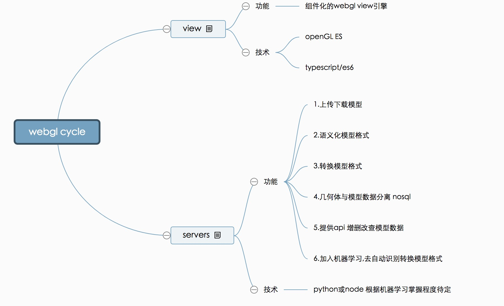

概述
--

最近公司在做一个大型的webgl应用，总结如下:

1.建模软件建模(3d Max revit)

2.自定义一套 语义化的模型格式，并编写模型格式转化插件,把建模软件的模型格式转成自定义格式。

**为什么要自定义语义化的模型格式呢？**

因为，现在浏览器的性能很尴尬说好不好，说差不差。得优化啊！
比如：模型里带了描述数据，指这单个模型的 长宽高 自定义数据等。这些数据往往是比较庞大的，而且每一个小模型都有，不可能随着模型加载到 浏览器上去。那么就得把模型数据，与几何数据分离。模型数据放数据库，几何数据保留，并且做一定优化，比如只存 原几何体的基础信息，通过变换得到 类似的几何体 
（很多场景下，有很多相同的 长方体，在模型格式中 可以 只存一个，其他的 copy出来）

3.浏览器性能有限，不能直接加载过大的模型文件，（太大了一直loading用户也受不了）就得 自己写 切割模型 的小工具，把大的模型，切成一个一个的小模型，按需加载，或者分布加载。

4.编写展现层对webgl的交互操作 封装，推荐库 Three.js babylon.js cannon.js xeogl.js 
各有强处这里就不做说明了。

5.后端提供 api 点击某个模型，返回对应的模型数据。

综上所述 webgl 的应用就是
----------------

 
1.webgl 展现层 封装基础 交互 操作等.

2.webgl 服务层 
1).提供用户上传模型  
2).自动转换模型且模型数据与几何数据分离  
3).自动把大模型切割成小模型 
4). 提供api

# 计划
 
http://naotu.baidu.com/file/5f44828aa0bcdd7758e2f3c47302d49c?token=9fb8f3ebd9842204

# 使用(只是demo占个坑先)
1.npm install || yarn install

2.npm run dev 

3.超级玛丽 模式操作 w、a、s、d 空格 (只做了向下的碰撞检测)

# SloceJson 使用
1.model 文件夹为原始模型文件

2.output 切割完后的模型文件

3.终端进入 该目录 node sliceJson.js

# 文档目录
1.src 源码

2.sliceJson 把大的模型文件切割成小模型  

3.static 静态资源 

4.config webpack 配置